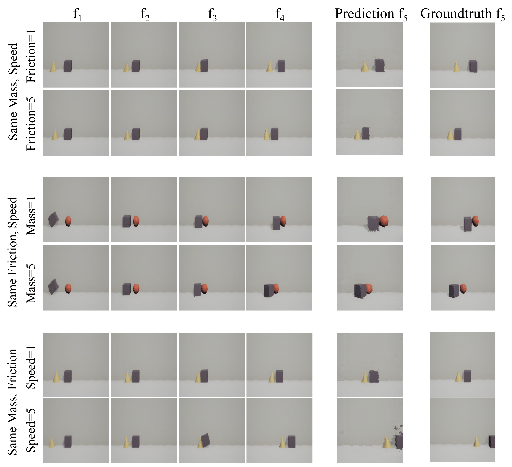
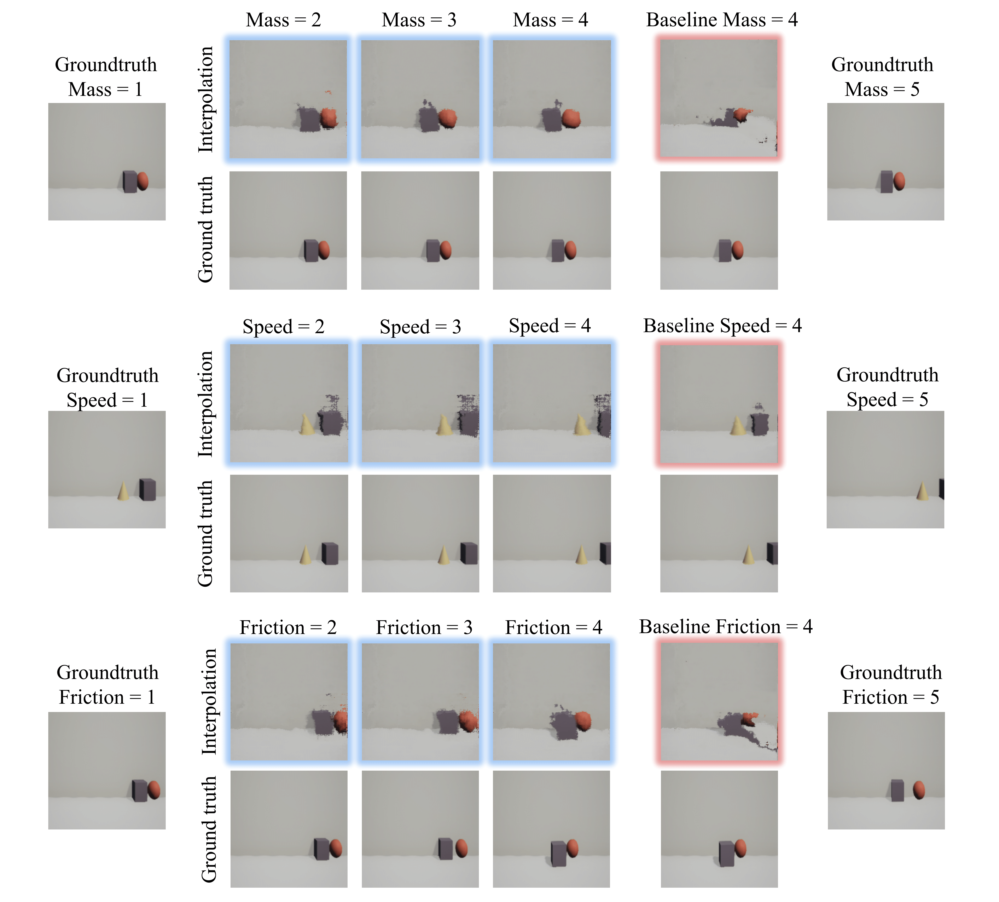

# Interpretable_Intuitive_Physics_Model

## Introduction
The model is described in the [ECCV 2018 paper: Interpretable Intuitive Physics Model](https://www.cs.cmu.edu/~xiaolonw/papers/ECCV_Physics_Cameraready.pdf). In this work, we propose a interpretable intuitive physics model where specific dimensions in the bottleneck layers correspond to different physical properties.

***

## Environment and installation
This repository is developed under **CUDA8.0** and **pytorch3.1** in **python2.7**. The required python packages can be installed by:
```bash
pip install http://download.pytorch.org/whl/cu80/torch-0.3.1-cp27-cp27mu-linux_x86_64.whl
pip install -r requirements.txt
```

## Data
- Coming soon ...

## Train
- Change `self.data_root`, `self.save_root` in `path.py` to your own path to data and save root.
- Run `python train.py`


## Evaluation
- For prediction results, run: `python test.py`
- For interpolation results, run: `python interpolation.py`


Prediction Result | Interpolation Result
:-------------------------:|:-------------------------:
  |  
