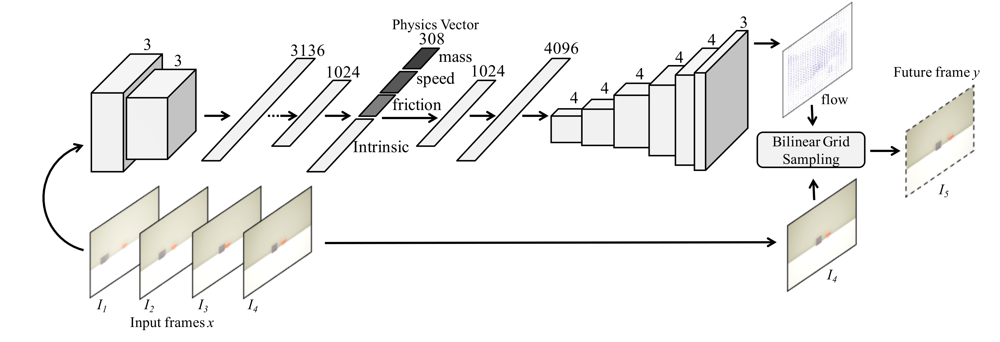
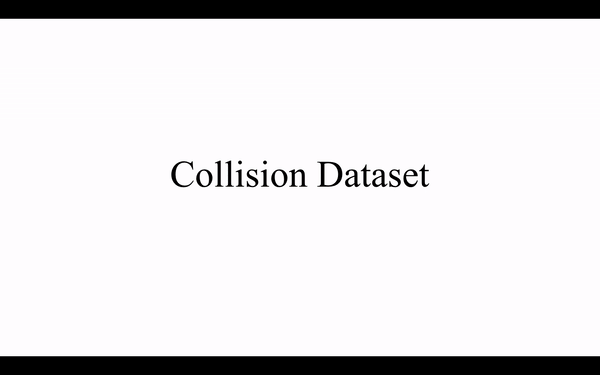
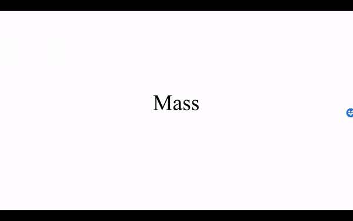
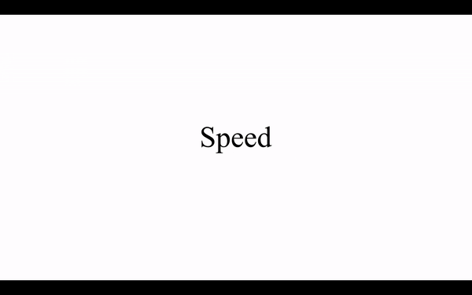
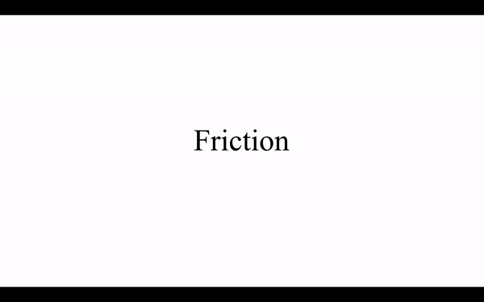
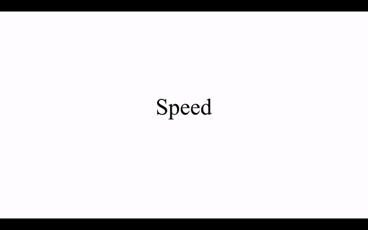
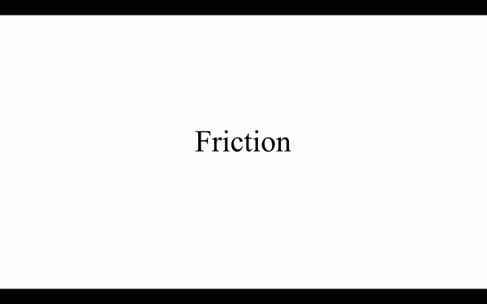

# Interpretable_Intuitive_Physics_Model

## Introduction
The model is described in the [ECCV 2018 paper: Interpretable Intuitive Physics Model](https://www.cs.cmu.edu/~xiaolonw/papers/ECCV_Physics_Cameraready.pdf). In this work, we propose a interpretable intuitive physics model where specific dimensions in the bottleneck layers correspond to different physical properties.


Model Architecture: our model follows an encoder-decoder framework. The encoder takes 4 frames of a collision (2 before collision, 1 during collision, and 1 after collision). All inputs are first passed through a pre-trained AlexNet. The AlexNet features are further appended along channels and are sent to two convolution layers and four fully-connected layers. The resulting physics vector is passed trhough a decoder consisting of one fully-connected layers and six up-sampling convolution layers to produce an optical flow. The number on the convolution layers stands for the kernel size of corresponding layer. The last bilinear grid sampling layer takes the optical flow and the 4th input frame to produce future prediction.
***

## Environment and installation
This repository is developed under **CUDA8.0** and **pytorch3.1** in **python2.7**. The required python packages can be installed by:
```bash
pip install http://download.pytorch.org/whl/cu80/torch-0.3.1-cp27-cp27mu-linux_x86_64.whl
pip install -r requirements.txt
```

## Dataset
- The dataset can be downloaded from [here](https://drive.google.com/open?id=1sb-RCGV13Yy1WlP8_2mGb5y76oLBpquk).
- Example data:
<div style="text-align:center"></div>


## Pre-trained Model
- Pre-trained model can be downloaded from
[here](https://drive.google.com/open?id=1r4G4xoAWdFZq_4ravPdVO4RUhJ6W5RCZ).

By default, the file structure looks like following. You can change the path to data and checkpoint in `/src/path.py`
```
/project_root
    /src
    /data
    /checkpoint
        /example
```


## Train
- Change `self.data_root`, `self.save_root` in `path.py` to your own path to data and checkpoint.
- Run `python train.p`.
- You can change the name of your current training using option `--project-name`. Your model will be saved to the corresponding folder under checkpoint.
- You can also set the physics parameters you want to train using `--train_labels` option, it is set to `["mass", "force", "friction"]` by default.


## Evaluation
- For prediction results, run: `python test.py`
- For interpolation results, run: `python interpolation.py`
- By default, these code use the pre-trained model saved in `checkpoint/example` for evaluation. To use your trained model, please use option `--project-name`

## Prediction results
This demo shows 4 input frames, the predicted 5th frame and ground-truth for collisions with unseen shape combinations. Contrast the predictions as one of physical property changes. For example, to show our approach understand these shapes, we predict for two different friction values in first case (keeping mass and speed same). The less motion in 2nd case shows that our approach understands the concept of friction.

Mass | 
:----:|:----:
Speed | 
Friction | 

## Interpolation results
This demo shows the interpolation results for physical quantity with different values. Interpolation experiment is conducted in the following way. Take mass as an example: we interpolate the physics vector for mass = 2, 3, 4, with physics vectors encoded by mass = 1, 5. For more detail of this experiment, please read Section 5.2 of our paper.

Mass | 
:----:|:----:
Speed | 
Friction | 
